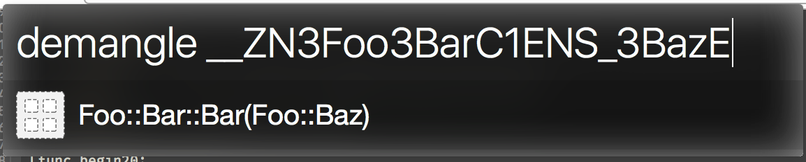

C++ Demangle Workflow
---

This workflow on the fly demangles c++ mangled names using whatever built in `c++filt` you have installed. Supports ⌘-c to copy the result and ⌘-l to large type the result (useful when the demangled symbol is really big). On ⏎ copies the result to clipboard.

Install
---

Double click the workflow.

Example:
---

